# Guide d'utilisation de Girabase (portage Python)

*Version 1.2 — octobre 2026*

*L’intelligence artificielle au service de l’action publique efficiente.*

Girabase calcule la **capacité des carrefours giratoires** : réserve de capacité de chaque entrée, files
d'attente, temps d'attente, avec les contrôles et les conseils de conception du logiciel d'origine. Ce programme
reprend **à l'identique** le moteur de **GIRABASE 4** (CERTU / CETE de l'Ouest), dont le CEREMA a publié le code
source sous licence GNU GPL v3. Les 24 résultats du cas de référence du guide Girabase 4 sont reproduits à
l'identique.

La version 1.2 ajoute :

- la **localisation du giratoire sur la carte de l'IGN** (photographie aérienne, routes, cadastre), partout en
  France. Un clic sur le carrefour donne le centre, l'anneau existant, les branches avec leur nom de route, leur
  orientation et leurs angles, la commune et les coordonnées ;
- un **serveur MCP**, qui permet aux assistants d'IA installés sur l'ordinateur d'utiliser Girabase.

---

## Sommaire

1. [Installation](#1-installation)
2. [Démarrage rapide](#2-démarrage-rapide)
3. [La fenêtre de calcul](#3-la-fenêtre-de-calcul)
4. [Localiser le giratoire sur la carte IGN](#4-localiser-le-giratoire-sur-la-carte-ign)
5. [Exports et fichiers](#5-exports-et-fichiers)
6. [Utiliser Girabase avec un assistant d'IA (MCP)](#6-utiliser-girabase-avec-un-assistant-dia-mcp)
7. [Sources des données et licences](#7-sources-des-données-et-licences)
8. [Fidélité au logiciel d'origine](#8-fidélité-au-logiciel-dorigine)
9. [Dépannage](#9-dépannage)
10. [Raccourcis clavier](#10-raccourcis-clavier)
11. [Glossaire](#11-glossaire)

---

## 1. Installation

**`Girabase.exe`** fonctionne sous Windows 10 ou 11, en 64 bits. C'est un fichier unique, sans installation et
sans droits d'administrateur : copiez-le où vous voulez (bureau, lecteur réseau, clé USB) et double-cliquez.
Le premier lancement prend quelques secondes.

- L'exécutable n'est pas signé. À la première ouverture, Windows SmartScreen peut afficher « Windows a protégé
  votre ordinateur ». Cliquez sur **Informations complémentaires**, puis **Exécuter quand même**.
- Si l'antivirus bloque le fichier unique, utilisez la **version dossier** (`Girabase-Windows.zip`). Décompressez
  l'archive et lancez `Girabase\Girabase.exe` : le démarrage est aussi plus rapide.
- Le calcul de capacité fonctionne **sans Internet**. Seule la carte IGN demande une connexion. Le proxy
  configuré dans Windows est utilisé automatiquement.
- **Auto-contrôle** : `Girabase.exe --autotest C:\temp` recalcule le cas du guide et contrôle la localisation.
  Il écrit son compte rendu dans `C:\temp\autotest_girabase.txt`, qui doit se terminer par « CONFORME ».

Le serveur MCP (`girabase-mcp.exe`) est décrit au [chapitre 6](#6-utiliser-girabase-avec-un-assistant-dia-mcp).

## 2. Démarrage rapide

1. **Fichier → Nouveau giratoire depuis la carte IGN** (Ctrl+Maj+N), ou le bouton **Localiser sur la carte IGN**
   de l'onglet Site.
2. Rapprochez-vous du carrefour à la **molette**. Vous pouvez aussi taper une commune, une adresse ou des
   coordonnées dans la barre de recherche.
3. Cliquez **Pointer le carrefour**, puis cliquez sur le carrefour : le centre, l'anneau, les branches et leurs
   angles sont proposés.
4. Ajustez l'**anneau projeté** au clavier (R, Bf, LA), puis cliquez **Envoyer dans Girabase**. Choisissez
   l'environnement : rase campagne, périurbain ou centre-ville.
5. Dans l'onglet **Trafics**, saisissez ou collez depuis Excel la matrice origine-destination de chaque période.
6. Lisez l'onglet **Résultats**, puis exportez la note de calcul en PDF et le schéma en DXF pour AutoCAD/COVADIS.

## 3. La fenêtre de calcul

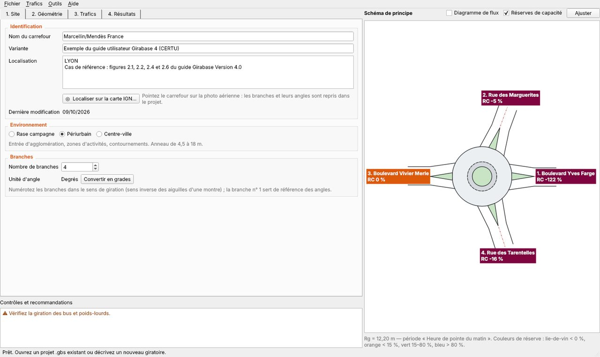

La fenêtre contient quatre onglets à gauche, le **schéma de principe** à l'échelle à droite, et en bas la zone
**Contrôles et recommandations**. Celle-ci signale en permanence les données à corriger (⛔) et les
recommandations de conception (⚠). Le calcul est refait automatiquement à chaque modification (F5 pour le
forcer).

### 3.1 Site

- **Nom du carrefour, variante, localisation** : ils sont repris dans la note de calcul. Le bouton
  **Localiser sur la carte IGN** ouvre la carte ([chapitre 4](#4-localiser-le-giratoire-sur-la-carte-ign)).
- **Environnement** : rase campagne, périurbain ou centre-ville. Il détermine les coefficients du calcul et les
  limites admissibles. Le calcul ne se lance pas tant qu'il n'est pas choisi.
- **Nombre de branches** : de 3 à 8.
- **Unité d'angle** : degrés ou grades (bouton de conversion).

Les branches sont **numérotées dans le sens de giration**, c'est-à-dire dans le sens inverse des aiguilles
d'une montre. La branche n° 1 sert de référence des angles.

### 3.2 Géométrie

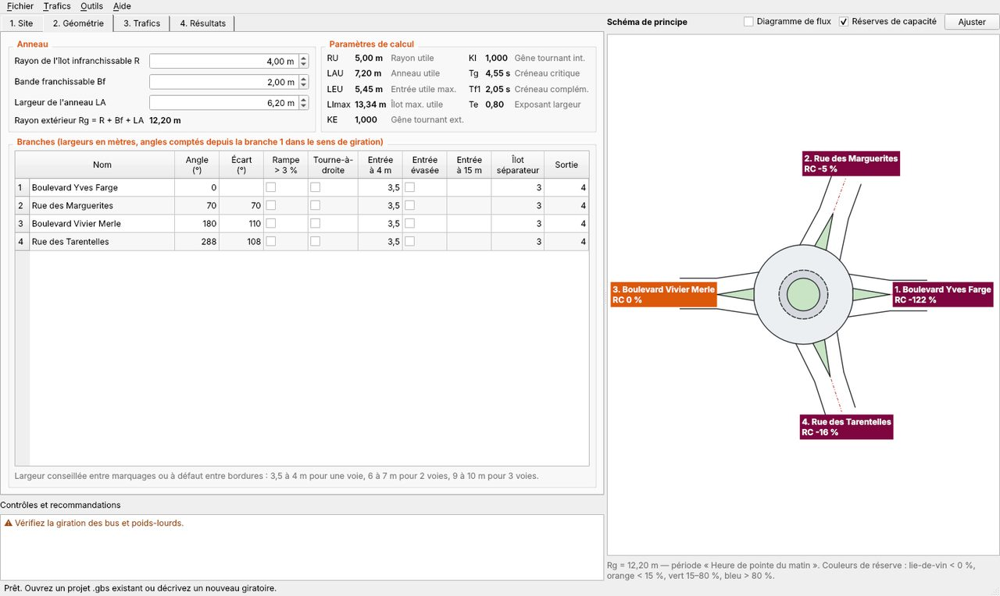

**Anneau :**
- **R** : rayon de l'îlot central infranchissable. Mettre 0 pour un mini-giratoire.
- **Bf** : largeur de la bande franchissable.
- **LA** : largeur de l'anneau.
- **Rg = R + Bf + LA** : rayon extérieur, calculé.

**Branches :**
- **Angle** depuis la branche 1.
- **Largeurs d'entrée** à 4 m (LE4) et à 15 m (LE15), avec la case **entrée évasée**.
- **Largeur d'îlot séparateur** LI et **largeur de sortie** LS.
- **Rampe** > 3 % en entrée.
- **Voie directe de tourne-à-droite**.

Une largeur d'entrée nulle désigne une sortie seule, une largeur de sortie nulle une entrée seule. Les paramètres
de calcul dérivés sont affichés à titre d'information : rayon utile, anneau utile, entrée utile maximale, LImax,
coefficients de gêne, créneaux.

### 3.3 Trafics

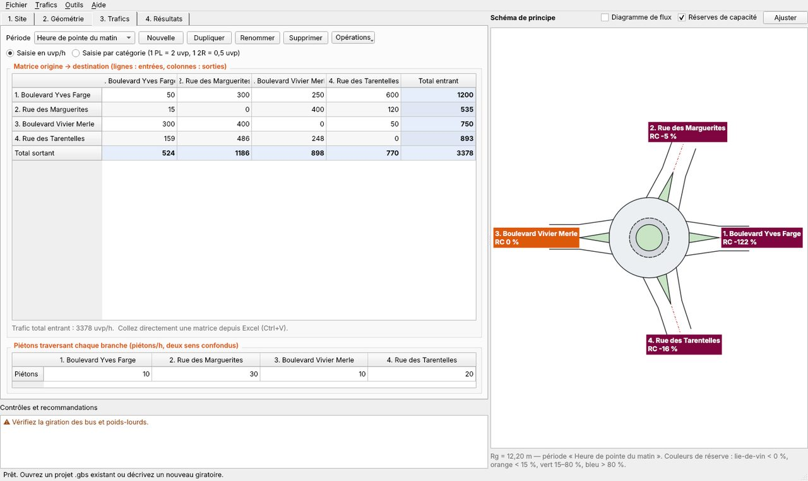

- **Périodes** : un projet peut en compter plusieurs (heure de pointe du matin, du soir, horizon…). Les boutons
  *Nouvelle*, *Dupliquer*, *Renommer* et *Supprimer* les gèrent.
- **Matrice origine → destination** : une ligne par branche d'entrée, une colonne par branche de sortie. La
  diagonale correspond aux demi-tours. Les totaux entrants et sortants sont calculés.
- **Mode de saisie** : en **uvp/h**, ou par catégorie **VL / PL / 2R** (1 PL = 2 uvp, 1 deux-roues = 0,5 uvp).
- **Coller depuis Excel** : sélectionnez la première case, puis Ctrl+V.
- **Piétons** traversant chaque branche (piétons/h, deux sens confondus).
- **Opérations** :
  - *Inverser la matrice* (HPM ↔ HPS) ;
  - *Multiplier les trafics* (coefficient global, par entrée ou par sortie) ;
  - *Importer les trafics d'un autre projet* ;
  - *Remplacer les cases vides par 0*.

Une période n'est calculée que si toutes ses cases utiles sont renseignées.

### 3.4 Résultats

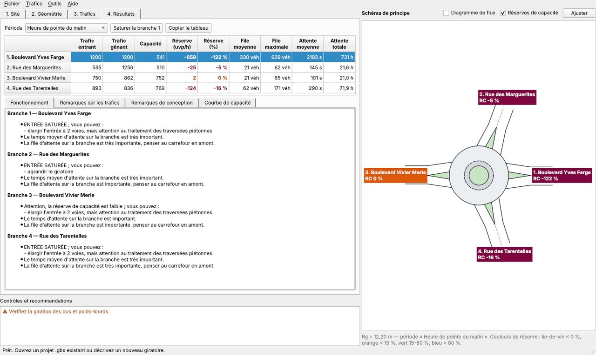

Pour chaque période et chaque entrée, le tableau donne :

- le trafic entrant et le trafic gênant ;
- la capacité ;
- la **réserve de capacité** en uvp/h et en % ;
- les files d'attente moyenne et maximale ;
- les temps d'attente moyen et total.

**Lecture de la réserve de capacité** (guide Girabase §1.3.1) :

| Réserve | Lecture | Couleur |
|---|---|---|
| < 0 % | entrée saturée | lie-de-vin |
| 0 à 15 % | réserve faible | orange |
| 15 à 80 % | fonctionnement correct | vert |
| > 80 % | entrée surdimensionnée | bleu |

Sous le tableau, quatre onglets reprennent les conseils de Girabase 4 :

- **Fonctionnement**, branche par branche ;
- **Remarques sur les trafics** ;
- **Remarques de conception** ;
- **Courbe de capacité**, qui trace la capacité de l'entrée en fonction du trafic gênant.

**Saturer la branche** recalcule le giratoire en limitant le trafic entrant d'une branche saturée à sa capacité.
Cela crée une période fictive, supprimable.

**Copier le tableau** permet de le coller dans Excel ou Word.

Le **schéma de principe** colore les branches selon leur réserve. Il peut afficher le **diagramme de flux**,
avec des largeurs proportionnelles aux trafics. Il suit la convention de Girabase : branche 1 à droite, angles
dans le sens de giration.

## 4. Localiser le giratoire sur la carte IGN

Ouvrez la carte depuis l'onglet **Site** (bouton *Localiser sur la carte IGN*), par **Outils → Localiser sur la
carte IGN** (Ctrl+L), ou par **Fichier → Nouveau giratoire depuis la carte IGN** (Ctrl+Maj+N).

### 4.1 Choisir l'emplacement

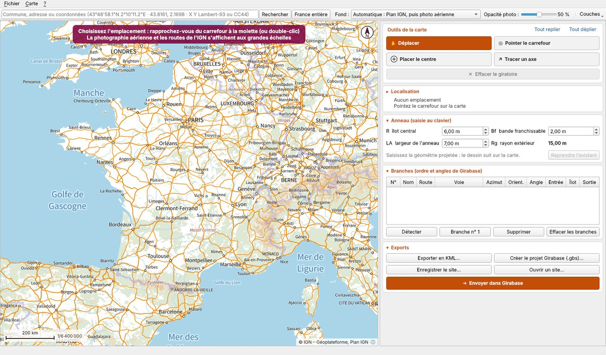

La carte s'ouvre sur **la France entière** (Plan IGN). On peut alors :

- **zoomer à la molette** : un niveau par cran, Maj + molette pour un zoom fin ;
- zoomer d'un **double-clic** avec l'outil *Déplacer* ;
- **déplacer la carte** en la faisant glisser, quel que soit l'outil choisi ;
- revenir à la France entière avec le bouton **France entière** (Ctrl+F).

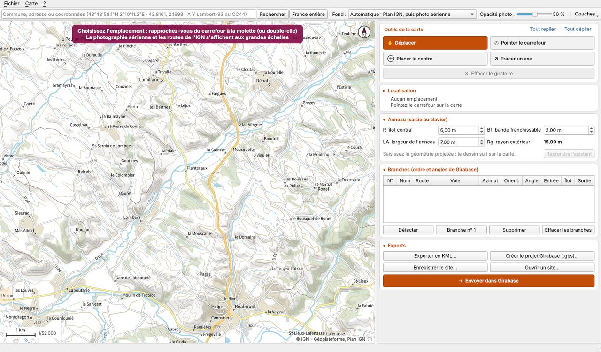

La **barre de recherche** accepte :

- une commune, une adresse ou un lieu-dit (géocodage IGN, résultats proposés dans une liste) ;
- des coordonnées, qui lancent directement l'analyse du carrefour situé à cet endroit :
  - degrés-minutes-secondes copiés de Google Maps : `43°48'58.1"N 2°10'11.2"E` ;
  - degrés décimaux : `43.8161, 2.1698` ;
  - **Lambert-93** : `633197.48 6302254.01` ;
  - **CC42 à CC50** : `1633212.25 3179908.97` ;
  - **outre-mer**, en UTM avec la zone ou le code EPSG en tête : `UTM 40S 342177 7639537` ou
    `EPSG:2975 342177 7639537` (La Réunion ; de même UTM 20N aux Antilles, 22N en Guyane, 38S à Mayotte,
    21N à Saint-Pierre-et-Miquelon).

### 4.2 Fonds de carte et couches

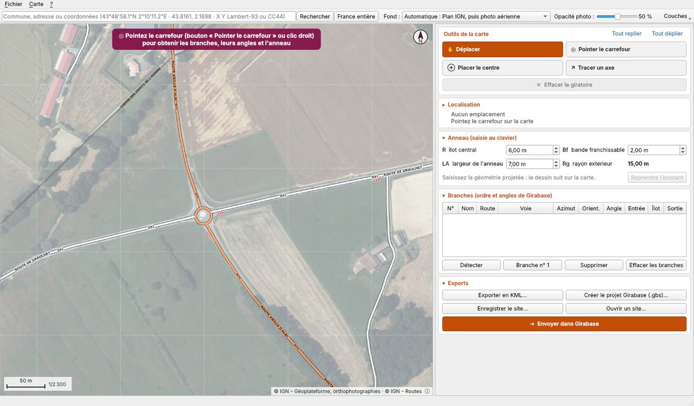

- **Fond automatique** (par défaut) : le Plan IGN sert à naviguer. Vers le 1/7 500 (niveau de zoom 16), la
  **photographie aérienne** de l'IGN le remplace, avec la couche **Routes** de cartes.gouv.fr (numéros et noms
  des routes). Une variante automatique part d'OpenStreetMap au lieu du Plan IGN.
- **Fonds fixes** : photographie aérienne, Plan IGN ou OpenStreetMap.
- **Opacité de la photo** : 50 % par défaut, pour que le dessin du giratoire ressorte sur la photo.
- **Menu Couches** :
  - Routes IGN ;
  - parcelles cadastrales ;
  - tronçons BD TOPO analysés (axes utilisés pour la détection) ;
  - schéma des voies du projet.
- **Échelle et sources** : l'échelle graphique et le rapport 1/x sont affichés en bas à gauche. La mention des
  sources est en bas à droite ; un clic dessus ouvre les licences.

### 4.3 Les outils de la carte

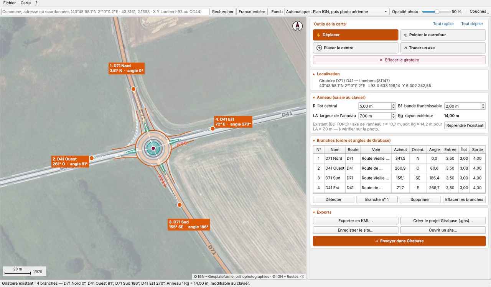

Les outils sont toujours visibles en haut du panneau de droite. Leurs touches (Échap, G, C, A) agissent quand
la carte a le focus : cliquez une fois sur la carte, ou choisissez l'outil par son bouton.

| Outil | Touche | Effet d'un clic sur la carte |
|---|---|---|
| ✋ **Déplacer** | Échap | aucun (glisser pour déplacer, double-clic pour zoomer) |
| ◎ **Pointer le carrefour** | G | analyse du carrefour dans la BD TOPO de l'IGN (voir ci-dessous) |
| ⊕ **Placer le centre** | C | centre du giratoire placé au point cliqué |
| ↗ **Tracer un axe** | A | axe d'une branche du centre vers le point cliqué ; route et nom de voie repris de la BD TOPO |
| ✕ **Effacer le giratoire** | — | efface le centre et toutes les branches ; R, Bf et LA sont conservés |

**Pointer le carrefour** fonctionne aussi par un **clic droit** sur la carte, via *Analyser le carrefour ici*.
Girabase lit alors les tronçons de route de la BD TOPO autour du point :

- **Giratoire existant** : le centre et le rayon de l'anneau sont obtenus par ajustement d'un cercle sur les
  tronçons « rond-point ». L'anneau projeté est proposé avec Rg ≈ rayon de l'axe + LA/2. Les branches sont les
  routes raccordées.
- **Carrefour plan** : le centre est placé sur l'intersection des routes, et les branches sont détectées de la
  même façon.
- **Pas de carrefour à moins de 40 m** : le centre reste au point cliqué, et l'outil *Tracer un axe* s'active.

Chaque branche reçoit :

- son **numéro de route** (D71…) et son **nom de voie** (Route vieille d'Albi…) ;
- son **azimut** et son **orientation** : *D71 Nord*, *D41 Est*… Si deux branches portent le même nom, il est
  précisé en huit directions (*D612 Nord-Est*), puis par l'azimut ;
- son **angle Girabase**, compté dans le sens de giration depuis la branche n° 1.

La branche n° 1 est par défaut **la plus proche du Nord**. Une route à **chaussées séparées** compte pour **une
seule branche** (entrée et sortie). Les sentiers, escaliers et pistes cyclables sont ignorés.

**Ajustements à la souris :**
- faire glisser la **poignée bordeaux** déplace le centre ;
- faire glisser une **poignée orange** fait tourner un axe ;
- un **clic droit sur une poignée** ouvre un menu : branche n° 1, renommer, supprimer.

### 4.4 Le panneau latéral

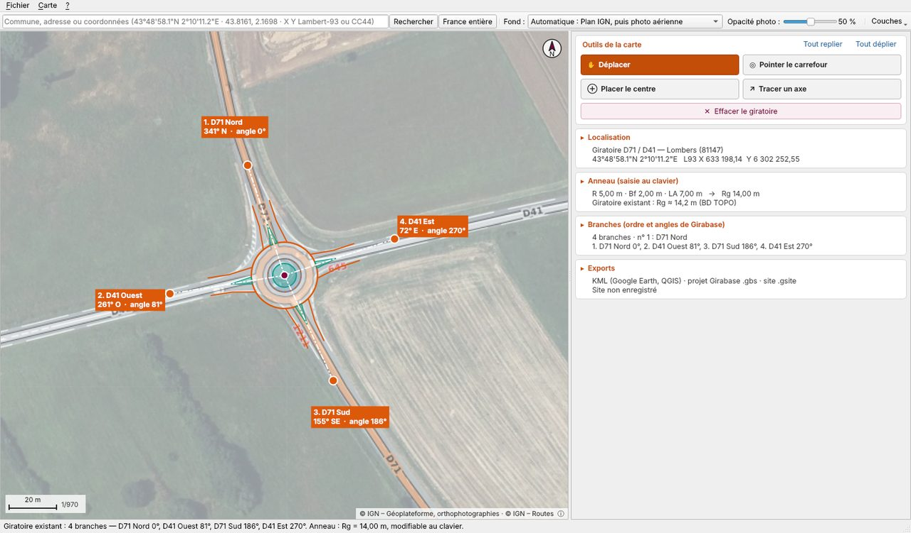

Les encarts **Localisation**, **Anneau**, **Branches** et **Exports** se replient d'un clic sur leur titre
(▸ / ▾). Repliés, ils affichent un résumé de deux lignes, et un clic sur ce résumé les déplie. Les liens
**Tout replier** et **Tout déplier** agissent sur tous les encarts à la fois. Tout replié, le panneau tient sur
un écran de portable ; tout déplié, l'ascenseur prend le relais. L'état de chaque encart est mémorisé.

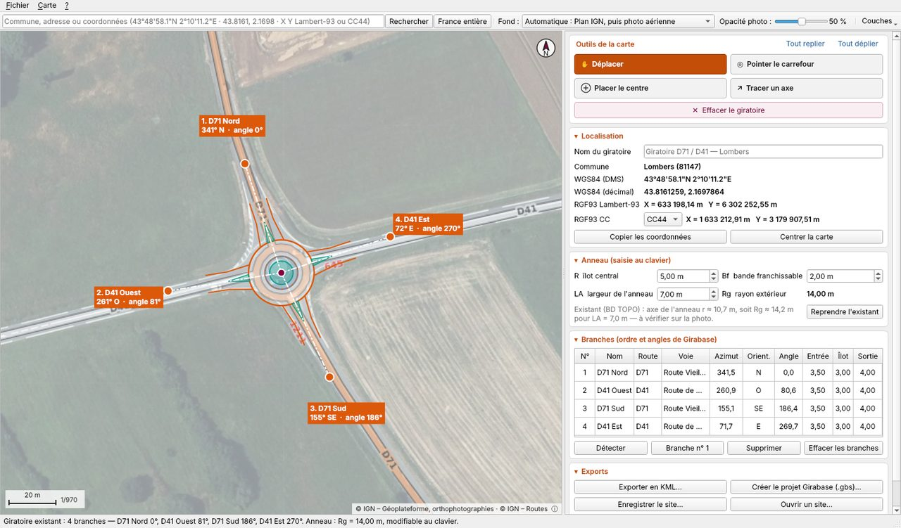

- **Localisation** : contient le nom du giratoire (proposé : *Giratoire D71 / D41 — Lombers*) et la commune
  avec son code INSEE. Les coordonnées sont données dans plusieurs systèmes :
  - **WGS84** en degrés-minutes-secondes et en décimal ;
  - **RGF93 Lambert-93** ;
  - **RGF93 CC**, avec la zone choisie automatiquement d'après la latitude (CC44 entre 43,25° et 44,75° N, par
    exemple) ou à la main ;
  - **outre-mer**, le système légal du territoire : RGAF09 UTM 20N (Antilles), RGFG95 UTM 22N (Guyane),
    RGR92 UTM 40S (La Réunion), RGM04 UTM 38S (Mayotte), RGSPM06 UTM 21N (Saint-Pierre-et-Miquelon).

  *Copier les coordonnées* les place dans le presse-papiers. Le menu **Carte** ouvre le lieu dans Google Maps,
  Street View ou le Géoportail.
- **Anneau (saisie au clavier)** : R, Bf et LA. Le rayon de l'anneau existant est rappelé pour comparaison, et
  le bouton *Reprendre l'existant* recale R dessus.
- **Branches** : le tableau suit l'ordre et les angles de Girabase. Double-cliquez une case pour modifier le
  nom, la route, la voie, l'azimut ou les largeurs du schéma. Les boutons sont *Détecter*, *Branche n° 1*,
  *Supprimer* et *Effacer les branches*.
- **Exports** : **Envoyer dans Girabase**, export KML, projet .gbs, enregistrement et ouverture d'un site.

### 4.5 Envoyer dans Girabase

**Envoyer dans Girabase** (Ctrl+Entrée) reprend le giratoire dans la fenêtre de calcul :

- **nouveau projet** : branches nommées, angles, anneau, localisation et mention des sources, après le choix de
  l'environnement. Girabase passe ensuite à l'onglet Trafics ;
- **mise à jour du projet ouvert**, si le nombre de branches est le même : noms, angles, anneau et localisation
  sont remplacés. **Les trafics et les largeurs sont conservés.**

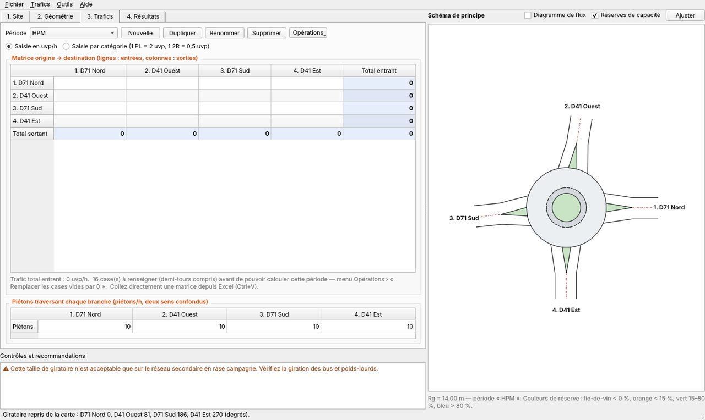

À l'enregistrement du projet `mon_giratoire.gbs`, la localisation est gardée dans `mon_giratoire.gsite`, à
côté du projet. Elle est retrouvée à la prochaine ouverture de la carte. Pour un projet sans fichier `.gsite`,
la carte s'ouvre sur les coordonnées WGS84 écrites dans la localisation.

### 4.6 Thème clair ou sombre

Girabase suit le réglage **Mode clair / sombre** de Windows, y compris en cours de session. Les couleurs des
boutons et des résultats sont choisies pour rester lisibles dans les deux thèmes.

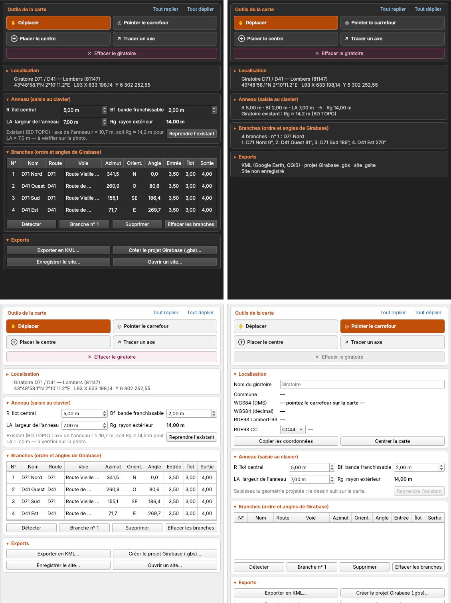

## 5. Exports et fichiers

| Fichier | Contenu | Ouverture |
|---|---|---|
| `.gbs` | projet Girabase (géométrie, branches, périodes, trafics) | Girabase Python et **Girabase 4 d'origine** (format identique) |
| `.gsite` | localisation sur la carte (centre, branches et azimuts, anneau, fond, sources) | Girabase 1.2 (JSON lisible) |
| `.pdf` | note de calcul, en-tête et pied de page paramétrables | tout lecteur PDF |
| `.dxf` | schéma DXF R12, 1 unité = 1 m, centre en (0, 0), branche 1 sur l'axe X | AutoCAD, COVADIS, toutes versions |
| `.kml` | schéma géoréférencé : centre, îlot, bande franchissable, anneau, axes, voies d'entrée et de sortie, îlots séparateurs | Google Earth, QGIS, Géoportail |

**Note de calcul** : *Fichier → Exporter la note de calcul (PDF)* (Ctrl+E) ou *Imprimer* (Ctrl+P). Les
*Paramètres de la note de calcul* règlent l'organisme, le service, l'auteur et le pied de page. Par défaut,
l'en-tête porte « Girabase — capacité des carrefours giratoires » et la devise « L’intelligence artificielle au service de l’action publique efficiente. » :
remplacez-les par le nom de votre collectivité et de votre service.

**DXF pour AutoCAD / COVADIS** : *Fichier → Exporter le schéma pour AutoCAD (DXF)* (Ctrl+D). Les calques sont
`GIRA_ILOT_CENTRAL`, `GIRA_BANDE_FRANCH`, `GIRA_ANNEAU`, `GIRA_BORDS_BRANCHES`, `GIRA_ILOTS_SEPARATEURS`,
`GIRA_AXES`, `GIRA_TEXTES` et `GIRA_FLUX`. Insérez le DXF dans le plan, puis calez-le avec DEPLACER et ROTATION
sur les coordonnées Lambert-93 ou CC du centre (encart Localisation).

## 6. Utiliser Girabase avec un assistant d'IA (MCP)

Le **Model Context Protocol** (MCP) est un standard ouvert par lequel un assistant d'IA utilise des outils
installés sur l'ordinateur. **`girabase-mcp.exe`** met le calcul de Girabase et l'analyse de carrefour IGN à la
disposition de tout client MCP : Claude Desktop, LM Studio, Jan, AnythingLLM, et d'autres.

Le serveur tourne **sur votre ordinateur**. Il n'envoie de requêtes qu'aux services de l'IGN, et seulement pour
analyser un carrefour ou chercher un lieu.

### 6.1 Installation

**Claude Desktop**
- Double-cliquez sur **`girabase.mcpb`** : Claude Desktop propose d'installer l'extension.
- À défaut, ajoutez ce bloc dans le fichier de configuration (*Paramètres → Développeur → Modifier la
  configuration*, fichier `%APPDATA%\Claude\claude_desktop_config.json`) :

  ```json
  {
    "mcpServers": {
      "girabase": { "command": "C:\\Outils\\Girabase\\girabase-mcp.exe" }
    }
  }
  ```

**LM Studio** (modèles locaux) : onglet *Program*, puis *Install → Edit mcp.json*, avec le même bloc
`"mcpServers"`. Choisissez un modèle qui sait appeler des outils (« tool use »).

**Autres clients** (Jan, AnythingLLM, Continue, Cline…) : déclarez un serveur MCP de type *stdio* dont la
commande est le chemin de `girabase-mcp.exe`, sans argument.

Pour vérifier l'installation : `girabase-mcp.exe --version` dans une invite de commandes.

### 6.2 Les outils

| Outil | Rôle | Internet |
|---|---|---|
| `calculer_capacite` | capacité, réserves, files, attentes, contrôles et conseils de Girabase 4, pour un giratoire décrit en JSON ou un fichier `.gbs` | non |
| `lire_projet_gbs` | lire un projet `.gbs` | non |
| `ecrire_projet_gbs` | créer un projet `.gbs`, qui s'ouvre dans Girabase (pas d'écrasement sans accord) | non |
| `analyser_carrefour` | à partir de coordonnées ou d'une adresse : giratoire existant ou carrefour, branches, noms, orientations, angles, commune, coordonnées ; renvoie un giratoire prêt à calculer | oui (IGN) |
| `convertir_coordonnees` | WGS84, DMS, Lambert-93, CC42–CC50, UTM outre-mer | non |
| `rechercher_lieu` | géocodage IGN d'une adresse ou d'un lieu | oui (IGN) |
| `exporter_kml` | schéma géoréférencé en KML | non |

### 6.3 Exemples de demandes

> « Analyse le giratoire situé à 43°48'58.1"N 2°10'11.2"E. Donne-moi les branches avec leur orientation et
> leurs angles. »

> « Avec ce giratoire en rase campagne, calcule la capacité pour l'heure de pointe du matin : D71 Nord vers
> D71 Sud 380 uvp/h, D71 Nord vers D41 Ouest 150… Quelles entrées sont saturées ? »

> « Ouvre C:\Projets\RD612\giratoire.gbs, multiplie les trafics de la période HPS par 1,2 et dis-moi si la
> réserve reste supérieure à 15 % sur toutes les entrées. »

> « Enregistre le projet dans C:\Projets\Lombers\D71-D41.gbs et exporte le schéma en KML. »

L'assistant peut se tromper dans l'interprétation d'une demande. Vérifiez les données d'entrée et ouvrez le
projet `.gbs` dans Girabase avant tout usage engageant.

## 7. Sources des données et licences

La carte et l'analyse de carrefour utilisent les **services publics de la Géoplateforme de l'IGN** :
photographies aériennes, Plan IGN, Routes, Parcellaire Express, BD TOPO®, ADMIN EXPRESS et géocodage. Ces
données sont diffusées sous **Licence Ouverte Etalab 2.0**. En option, la carte peut utiliser
**OpenStreetMap** (ODbL, tuiles CC BY-SA).

Girabase affiche les mentions de source sur la carte. Après une analyse, il écrit la mention de paternité
demandée par la licence, avec le producteur, les données et les dates de mise à jour et de consultation, dans :

- le projet `.gbs` ;
- le fichier de site `.gsite` ;
- le KML.

Il respecte aussi les conditions d'utilisation des services : limites de débit, identification de
l'application et cache local. Le détail est dans *Aide → Sources des données cartographiques et licences* et
dans [`sources-et-licences.md`](sources-et-licences.md).

La géométrie proposée à partir de la BD TOPO® est **schématique**. Elle est à vérifier sur un plan
topographique.

## 8. Fidélité au logiciel d'origine

Le moteur est une transcription du code Visual Basic 6 de Girabase 4 (`GIRATOIRE.cls`, `BRANCHE.cls`,
`TRAFIC.cls`) : mêmes formules, mêmes coefficients, mêmes arrondis (nombres simple précision et entiers de
VB6), mêmes messages de conseil.

Il a été validé sur le **cas complet du guide utilisateur Girabase 4** (Marcellin / Mendès France, Lyon,
périurbain). Les 24 valeurs de résultats et les conseils sont identiques, et le contrôle est relancé par
`--autotest`.

Les différences connues, mineures, sont décrites dans le README du dépôt :
- les deux-roues sont tronqués comme dans le code ;
- un nombre de piétons vide compte pour 0 ;
- au-delà de 2 500 uvp/h, Girabase émet un avertissement.

Ce portage n'est ni édité ni validé par le CEREMA. Pour une étude engageante, comparez sur un cas de référence.

## 9. Dépannage

| Symptôme | Que faire |
|---|---|
| « Services IGN injoignables » | Vérifiez la connexion Internet. Le proxy de Windows est utilisé ; en cas de proxy avec authentification particulière, voyez avec votre service informatique. Le calcul fonctionne sans réseau. |
| Tuiles grises ou manquantes | Le service répond lentement : Girabase réessaie automatiquement. Les tuiles déjà vues restent en cache (300 Mo au plus). |
| Aucun carrefour détecté | Le point est à plus de 40 m d'une intersection de la BD TOPO : placez le centre (C) et tracez les axes (A). |
| SmartScreen bloque le lancement | *Informations complémentaires → Exécuter quand même* (exécutable non signé). |
| L'antivirus supprime Girabase.exe | Utilisez la version dossier (`Girabase-Windows.zip`). |
| Arrêt brutal du logiciel | La cause est écrite dans `%TEMP%\girabase_plantage.txt` : joignez ce fichier à votre signalement. |
| L'assistant d'IA ne voit pas Girabase | Vérifiez le chemin de `girabase-mcp.exe` dans la configuration, puis redémarrez complètement le client d'IA. |

## 10. Raccourcis clavier

**Fenêtre de calcul**

| Action | Raccourci |
|---|---|
| Nouveau giratoire | Ctrl+N |
| Nouveau giratoire depuis la carte IGN | Ctrl+Maj+N |
| Ouvrir, enregistrer, enregistrer sous | Ctrl+O, Ctrl+S, Ctrl+Maj+S |
| Note de calcul PDF, impression | Ctrl+E, Ctrl+P |
| Schéma DXF | Ctrl+D |
| Localiser sur la carte IGN | Ctrl+L |
| Recalculer | F5 |
| Guide d'utilisation | F1 |

**Carte IGN**

| Action | Raccourci |
|---|---|
| Déplacer, Pointer le carrefour, Placer le centre, Tracer un axe (carte active) | Échap, G, C, A |
| Supprimer la branche sélectionnée (carte active) | Suppr |
| Nouveau site, ouvrir un site, enregistrer, enregistrer sous (fichier `.gsite`) | Ctrl+N, Ctrl+O, Ctrl+S, Ctrl+Maj+S |
| France entière, centrer sur le giratoire | Ctrl+F, Ctrl+Origine |
| Analyser le carrefour, détecter les branches | Ctrl+D, Ctrl+B |
| Envoyer dans Girabase | Ctrl+Entrée |
| Export KML, projet .gbs | Ctrl+K, Ctrl+G |
| Zoom | molette (Maj + molette : zoom fin), double-clic avec l'outil Déplacer |

## 11. Glossaire

| Terme | Définition |
|---|---|
| **R** | rayon de l'îlot central infranchissable (0 pour un mini-giratoire) |
| **Bf** | largeur de la bande franchissable autour de l'îlot |
| **LA** | largeur de la chaussée annulaire |
| **Rg** | rayon extérieur du giratoire, Rg = R + Bf + LA |
| **LE4, LE15** | largeur de l'entrée à 4 m et à 15 m de la ligne de cédez-le-passage |
| **LI** | largeur de l'îlot séparateur à la base du triangle de construction |
| **LS** | largeur de la sortie |
| **uvp** | unité de véhicule particulier (1 PL = 2 uvp, 1 deux-roues = 0,5 uvp) |
| **QE** | trafic entrant d'une branche |
| **QG** | trafic gênant au droit de l'entrée (circulant sur l'anneau et sortant) |
| **C** | capacité de l'entrée |
| **RC** | réserve de capacité, C − QE, en uvp/h ou en % de C |
| **Azimut** | direction de l'axe d'une branche, en degrés, sens horaire depuis le Nord géographique |
| **Angle Girabase** | angle d'une branche depuis la branche n° 1, compté dans le sens de giration |
| **BD TOPO®** | base de données topographique de l'IGN (routes, numéros, noms de voies) |
| **Lambert-93, CC42 à CC50** | projections légales RGF93 de la France métropolitaine (CC : coniques conformes 9 zones) |
